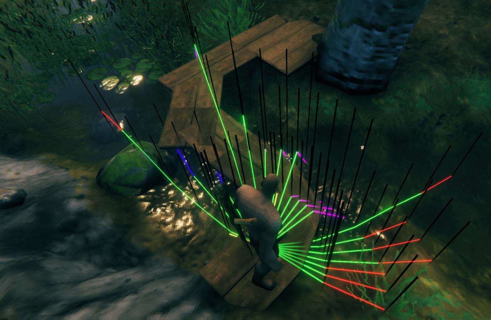

# BetterAutoRun

BetterAutoRun is a client-side [BepInEx](https://github.com/BepInEx/BepInEx) plugin for Valheim. It improves autorun by following roads and terrain, avoiding obstacles and hazardous ground, supporting bridges, and steering mounts.




## Features

- Follows paths and roads while autorun is active
- Navigates through wilderness and over player-built bridges
- Avoids water, lava, tar pits, steep drops, and obstacles
- Supports autorun while riding
- Provides an optional autosprint toggle
- Detects when the player is stuck and can perform an evasive jump
- Includes optional visual pathfinding diagnostics

## Requirements

- Valheim
- BepInExPack for Valheim 5.4.2202 or newer compatible release

Jotunn is not required.

## Installation

### Mod manager

Install BetterAutoRun and its declared dependencies through Gale, Thunderstore Mod Manager, or r2modman. The same Thunderstore package works with all three managers.

### Manual

1. Install BepInExPack for Valheim.
2. Copy `BetterAutoRun.dll` into `Valheim/BepInEx/plugins/BetterAutoRun/`.
3. Start Valheim once to create `org.bepinex.plugins.bid.betterautorun.cfg`.

## Usage

Enable Valheim autorun as usual. BetterAutoRun adjusts the movement direction while autorun is active. Press Left Shift once to toggle autosprint; the shortcut can be changed in the BepInEx configuration.

Right-clicking while autorunning resets the preferred direction to the current look direction.

## Configuration

The most commonly useful settings are:

| Setting | Default | Purpose |
| --- | ---: | --- |
| `enabled` | `true` | Enables path-following behavior |
| `AutoSprint` | `LeftShift` | Toggles automatic sprinting |
| `GlobalSprintToggle` | `false` | Allows the sprint toggle outside autorun |
| `KeepAutoRunOnJump` | `true` | Keeps autorun enabled when jumping |
| `StaminaMinThreshold` | `30` | Stops automatic sprint below this stamina level |
| `PavedOnly` | `false` | Restricts path detection to paved roads |
| `MaxAngle` | `90` | Maximum path-search angle |
| `PathPoints` | `10` | Number of one-metre path samples checked in front of the player |
| `EvadeJumpEnabled` | `true` | Jumps when movement appears stuck |
| `EvadeJumpGracePeriodMillis` | `500` | Delay before stuck-triggered jumps are allowed after autorun starts |
| `EvadeJumpMovementThreshold` | `0.05` | Minimum movement in metres between checks before an evade jump is triggered |
| `PathDirectionOverrideDurationMillis` | `3000` | How long a selected direction is preferred on paths after mouse input |
| `VisualDebug` | `false` | Draws pathfinding diagnostics |

All settings are documented in the generated BepInEx config file. On servers running BetterAutoRun:

- settings under `Server config` are controlled by the server and synchronized to every BetterAutoRun client;
- only players listed as Valheim server administrators may change those settings through BepInEx Configuration Manager;
- gameplay and pathfinding settings use the server value when joining, but remain locally overridable for the current connection; and
- personal settings such as key bindings, visual debugging, and enabling the mod remain client-only.

Values received from a server do not overwrite the client's persisted configuration file. If the server does not run BetterAutoRun, all settings remain local.

When `VisualDebug` is enabled, the selected path is highlighted in yellow. Near-collision candidate paths are shown in cyan when accepted and red when rejected.

## Building

The project targets .NET Framework 4.6.2 and expects a local Valheim installation. Do not commit game assemblies: they contain proprietary game code.

Set these environment variables before building:

- `VALHEIM_INSTALL`: directory containing `valheim.exe`
- `BEPINEX_PATH`: directory containing the BepInEx development assemblies; if omitted, the build uses `%VALHEIM_INSTALL%/BepInEx/core`

For Visual Studio, copy `Config.Build.user.props.example` to
`Config.Build.user.props` and enter the local paths there. The user-specific file
is ignored by Git. Command-line builds can use either this file or the environment
variables above.

The publicized game assembly is expected at:

```text
%VALHEIM_INSTALL%/valheim_Data/Managed/publicized_assemblies/assembly_valheim_publicized.dll
```

Restore packages and build:

```powershell
git submodule update --init --recursive
nuget restore BetterAutoRun.sln
dotnet build BetterAutoRun.sln --configuration Debug --no-restore
```

A Release build invokes `scripts/Package.ps1` automatically and creates `artifacts/BetterAutoRun-<version>.zip`.

The reusable synchronization implementation is maintained in the separate `ValheimConfigSync` repository and included under `Libraries/ValheimConfigSync` as a Git submodule and Visual Studio shared project. Its source is compiled directly into BetterAutoRun, so no additional runtime DLL is required.

## Compatibility and support

Please include the BetterAutoRun version, Valheim version, BepInEx version, relevant configuration, and BepInEx log when reporting a problem. Avoid uploading logs containing private server addresses or tokens.

## Contributing

See [CONTRIBUTING.md](CONTRIBUTING.md).

## License

BetterAutoRun is free software distributed under the [GNU General Public License v3.0 or later](LICENSE).

You may use, share, and modify it. When a modified version is distributed, it must remain under the GPL, provide its corresponding source code, preserve the applicable copyright and license notices, and clearly identify its changes. See [NOTICE.md](NOTICE.md) for the project attribution.
